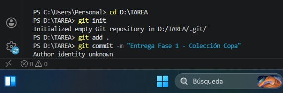
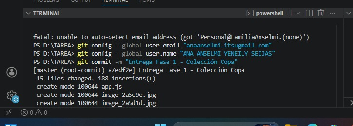
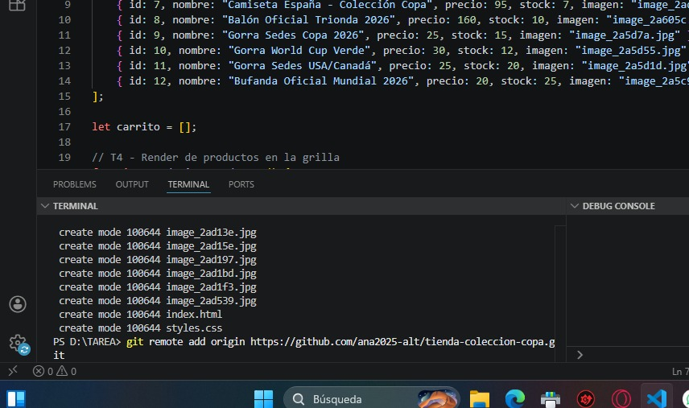
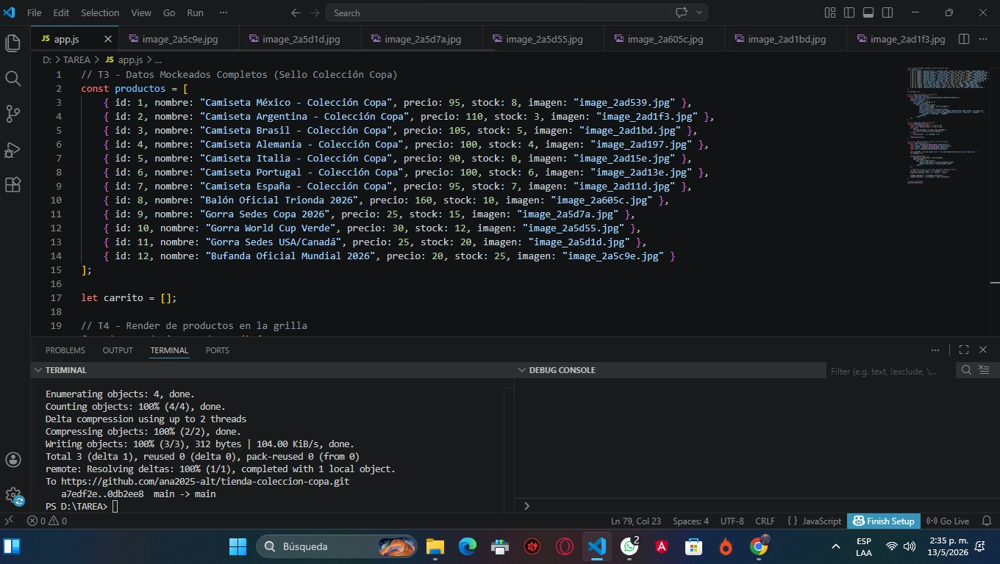

# Proyecto: Tienda Colección Copa 2026
## 👥 Autores del Proyecto
**Estudiante:** Ana Anselmi , Yeneily Seijas
**Carrera:** Programación
**Entrega:** Fase 1 - Fase2 Hackathon Clase 02

## Descripción
Este proyecto es una tienda ficticia de merchandising para el Mundial 2026, cumpliendo con el Brief 05. Incluye camisetas, pelotas, gorras y bufandas con el sello "Colección Copa".

## Funcionalidades de la Fase 1
- Catálogo dinámico de 12 productos.
- Carrito de compras funcional (agregar productos).
- Validación de stock en tiempo real.
- Aplicación automática de descuento (10%) al llevar 3 o más productos distintos.

## Cómo ejecutarlo
Para ver la página en funcionamiento, simplemente abre el archivo `index.html` en cualquier navegador moderno.

# 🏆 COLECCIÓN COPA 2026 - FASE 2

¡Bienvenido al repositorio oficial de la tienda de merchandising del Mundial! Este proyecto ha evolucionado a una aplicación web dinámica.

🏆 COLECCIÓN COPA 2026 - FASE 2

¡Repositorio actualizado! La tienda ya cuenta con lógica dinámica y gestión de datos.

## 🚀 Cambios Realizados
- **Objetos y Arreglos:** Catálogo de productos manejado con JavaScript.
- **Carrito Dinámico:** Cálculo de precios y descuentos automáticos.
- **Gestión de Stock:** El inventario se actualiza al comprar.
- **Captura de Datos:** Formulario para registrar clientes.

## 📸 Evidencias de la Fase 2
Aquí están las capturas de mi progreso:

 

### 🔄 Últimos Ajustes Realizados:
- **Interactividad:** Activación del buscador principal.
- **UI/UX:** Incorporación de fondo animado mundialista.
- **Seguridad:** Validación de formularios de envío. 
🔄 Actualización de Merchandising y Efectos Visuales
🥤 Inclusión de Nueva Línea de Productos (Termos)
Se expandió el catálogo de objetos en app.js para incluir artículos de hidratación oficial:

Termos de Acero Inoxidable: Modelos con aislamiento térmico y diseño "Copa 2026".

Edición Ejecutiva: Variantes en color negro con detalles dorados para un perfil más profesional.

Balones de Colección: Se sumaron modelos retro y ediciones especiales de sedes (Canadá/USA).

🎈 Sistema de Partículas Flotantes Dinámicas
Se mejoró la experiencia inmersiva en el index.html y styles.css:

Variedad de Objetos: Ahora no solo flotan balones (⚽), sino también trofeos (🏆) y termos (🥤), creando una atmósfera de tienda mundialista completa.

Lógica de Animación: Cada elemento tiene un animation-duration y animation-delay diferente generado en el HTML, lo que evita que todos suban al mismo tiempo y les da un movimiento más natural y aleatorio.

🌟 Efecto de Interacción (Shine Effect)
Se programó un efecto de "brillo viajero" en CSS usando el pseudo-elemento ::after y gradientes lineales. Al pasar el mouse sobre cualquier producto (camisetas, termos o balones), un destello recorre la tarjeta, resaltando el producto de manera elegante.  

## 👥 Autores del Proyecto
- **Desarrolladoras Principales:** Ana Anselmi & Yeneily Seijas 🎓
- **Especialidad:** Informática - Proyecto Fase 2 (Mayo 2026)

---

### 🔄 Detalles de la Última Actualización (Entrega Final)

#### 1. 🥤 Integración de la Línea de Termos Internacionales
Se expandió el catálogo de datos en `app.js` agregando una colección exclusiva de termos de acero inoxidable personalizados con las banderas de los países sedes e invitados:
- **Termo México 2026** (Diseño Azteca)
- **Termo Canadá 2026** (Diseño Hoja de Maple)
- **Termo USA 2026** (Diseño Barras y Estrellas)
- **Termo Colombia 2026** (Diseño Tricolor)
- **Termo South Africa 2026** (Edición Especial)
- **Combo Colección Completa:** Inclusión de una tarjeta especial en la grilla que muestra el set completo de termos reunidos.

#### 2. 🎛️ Corrección Estructural del Layout y Cuadrícula (Grid)
- **Alineación en Filas:** Se reestructuró el archivo `styles.css` aplicando propiedades avanzadas de CSS Grid (`grid-template-columns: repeat(auto-fill, minmax(240px, 1fr))`) para forzar que todos los productos se rendericen de forma continua, uno al lado del otro, adaptándose al tamaño de la pantalla.
- **Fijación del Carrito (Sidebar):** Se corrigió el estiramiento vertical del contenedor mediante `align-items: flex-start`, devolviendo el carrito de compras a su posición original como barra lateral derecha flotante y sticky.

#### 3. 🎈 Optimización de Partículas Flotantes (UI/UX)
- Se incrementó la opacidad base y se añadieron propiedades de iluminación de neón (`drop-shadow`) a los elementos del fondo. Ahora los balones (⚽), trofeos (🏆) y termos (🥤) rotan en un eje de 720 grados mientras suben, logrando una atmósfera mundialista mucho más llamativa e inmersiva.

#### 4. 📄 Inclusión del Archivo de Especificaciones Técnicas (Spec)
- Se creó e integró al repositorio el archivo `spec.json` bajo el estándar técnico exigido, mapeando los requerimientos cumplidos (desde T3 hasta T9), los autores en formato de arreglo indexado y la arquitectura de manipulación dinámica del DOM de la aplicación. 

#### 5. 🛒 Optimización de la Lógica de Pedidos y Control de Inventario
- **Validación Estricta de Correo Electrónico:** Se integró una expresión regular (`regex`) en la función `finalizarCompra()` para obligar al sistema a verificar que el usuario ingrese un formato de correo real (con `@` y un dominio válido como `.com`), bloqueando cadenas de texto aleatorias.
- **Descuento Dinámico de Stock:** Se programó un ciclo que recorre el carrito al confirmar el pedido, localiza el producto original mediante su `id` y resta la cantidad comprada directamente de su propiedad `stock`.
- **Refresco Automático de Interfaz:** Al completarse la venta, la grilla se vuelve a renderizar inmediatamente mostrando la disminución real del stock disponible en las tarjetas de los productos.
- **Depuración de Atributos:** Se corrigió un bug en la asignación de propiedades del carrito, unificando el contador bajo la variable estándar `cantidad` para evitar conflictos en el motor de cálculo del subtotal.  

## 🛠️ Historial de Cambios y Distribución de Tareas - Fase 3

En esta fase se realizó una reestructuración completa del proyecto, migrando de un diseño monolítico a una arquitectura modular basada en **ES Modules (JavaScript Moderno)**, aplicando principios SOLID para mejorar la escalabilidad, el mantenimiento y la limpieza del código.

### 👥 Distribución de Desarrollo (Sprint Modular)

Para optimizar el desarrollo de la estructura modular, el equipo distribuyó los módulos y responsabilidades de la siguiente manera:

* **Desarrollado por Ana:**
    * **Arquitectura Base:** Creación del punto de entrada principal (`js/main.js`) y configuración del script en el HTML como `type="module"`.
    * **Gestión de Datos:** Creación y exportación del módulo de productos (`js/productsData.js`), centralizando el catálogo de merchandising oficial.
    * **Documentación Técnica:** Redacción del diagnóstico, reporte de mejoras y el plan de acción final en la carpeta `docs/`.

* **Desarrollado por Yeneily:**
    * **Lógica del Carrito:** Creación del módulo del motor de compras (`js/cartEngine.js`), encargada de las funciones de agregar, calcular subtotales y vaciar el carrito.
    * **Renderizado de Interfaz:** Creación del módulo de UI (`js/uiManager.js`), encargada de pintar dinámicamente los productos en el DOM y actualizar los estados visuales.
    * **Estilos y Ajustes Visuales:** Acoplación del sistema de módulos con el diseño *Dark Mode* y optimización de las animaciones de los elementos flotantes.

---

### 🔄 Resumen Técnico de Modificaciones

1. **Estructuración de Carpetas:** Se limpió la raíz del proyecto moviendo toda la lógica de JavaScript dentro de la carpeta contenedora `/js` y la documentación a `/docs`.
2. **Desacoplamiento de Código:** Se eliminaron las funciones globales y se reemplazaron por `import` y `export` selectivos para evitar la contaminación del *scope* global.
3. **Optimización de Carga:** Se configuró la carga asíncrona de los módulos mediante el evento `DOMContentLoaded` en el inicio de la aplicación. 